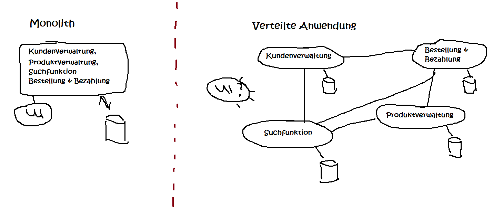
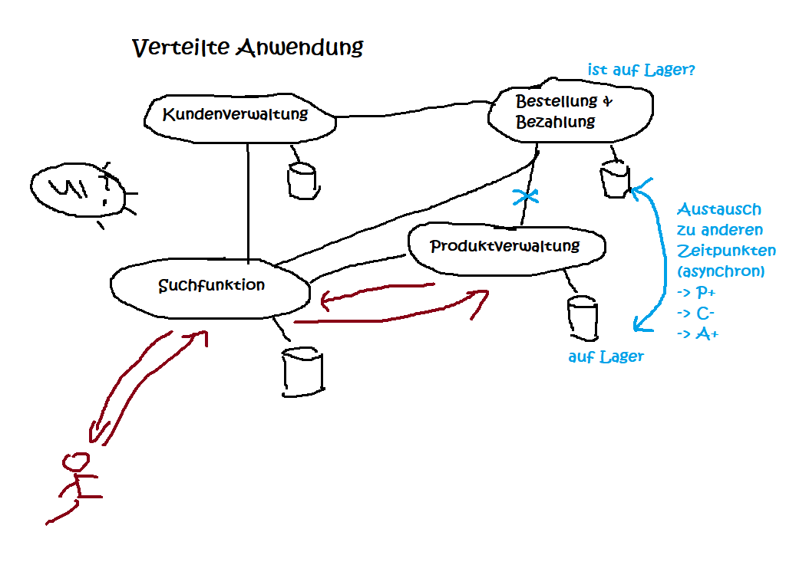

# Messaging

## Monolith vs. Verteilte Anwendungen

### Vorteile verteilter Anwendungen

- Flexiblere Skalierbarkeit
- Entwicklung, Wartbarkeit, Fehlersuche einfacher, da Anwendungen aufgeteilt (isoliert)
- Austauschbarkeit einzelner Module ist einfacher
- bei Ausfall eines Moduls fällt nicht alles aus
- pro Anwendung kleinere Teams -> Abstimmungsaufwände team-intern geringer
- Implementierung in unterschiedlichen Programmiersprachen möglich

### Herausforderungen verteilter Anwendung

- Netzwerk von Anwendungen
  - Integrationstest  
  - Fehlersuche komplexer, wenn zwischen den Anwendungen
  - Staging
- Höhere Aufwände für Datenbanken (Migration), Bauen, Testen, Deployment, Projektmanagement
  - Automatisierung!
- Resilience Patterns
- evtl. mehr Personal
- mehr Abstimmung zwischen den Teams
- sauber definierte Aufrufschnittstellen (REST vs. SOAP)
- Netzwerklatenzen (langsamer)
- Datenhoheit
- CAP-Theorem

### CAP-Theorem 

- 3 Kriterien
  - _Consistency_: Daten sind konsistent über das Gesamtsystem (an Anwendungen)
  - _Availability_: Anfragen an das Gesamtsystem werden performant beantwortet
  - _Partition Tolerance_: bei Ausfall eines Knotens funktioniert noch der Rest
- bei verteilten Anwendungen können nur 2 von 3 Anforderungen erfüllt werden
  - _CA_: relationale Datenbanksysteme (DBMS)
  - _AP_: DNS (mehrere Server, aber Synchronisation dauert mitunter mehrere Tage)
  - _CP_: Finanzen / Banking (Überweisungen)

