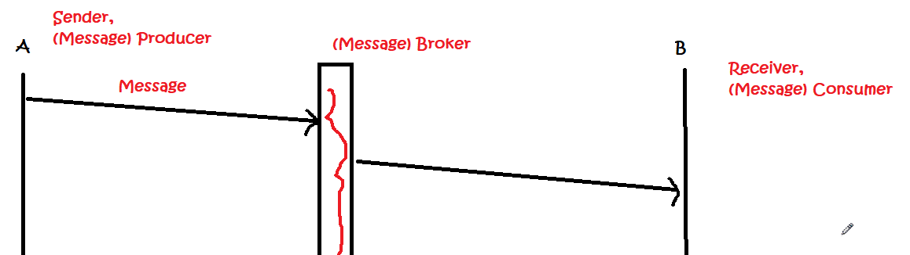
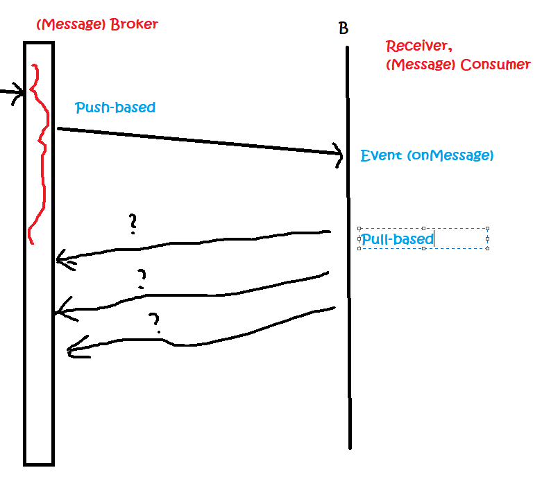
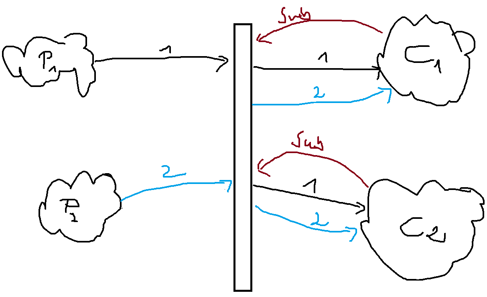

# Messaging

## Monolith vs. Verteilte Anwendungen

### Vorteile verteilter Anwendungen

- Flexiblere Skalierbarkeit
- Entwicklung, Wartbarkeit, Fehlersuche einfacher, da Anwendungen aufgeteilt (isoliert)
- Austauschbarkeit einzelner Module ist einfacher
- bei Ausfall eines Moduls fällt nicht alles aus
- pro Anwendung kleinere Teams -> Abstimmungsaufwände team-intern geringer
- Implementierung in unterschiedlichen Programmiersprachen möglich

### Herausforderungen verteilter Anwendung

- Netzwerk von Anwendungen
  - Integrationstest  
  - Fehlersuche komplexer, wenn zwischen den Anwendungen
  - Staging
- Höhere Aufwände für Datenbanken (Migration), Bauen, Testen, Deployment, Projektmanagement
  - Automatisierung!
- Resilience Patterns
- evtl. mehr Personal
- mehr Abstimmung zwischen den Teams
- sauber definierte Aufrufschnittstellen (REST vs. SOAP)
- Netzwerklatenzen (langsamer)
- Datenhoheit
- CAP-Theorem

### CAP-Theorem 

- 3 Kriterien
  - _Consistency_: Daten sind konsistent über das Gesamtsystem (an Anwendungen)
  - _Availability_: Anfragen an das Gesamtsystem werden performant beantwortet
  - _Partition Tolerance_: bei Ausfall eines Knotens funktioniert noch der Rest
- bei verteilten Anwendungen können nur 2 von 3 Anforderungen erfüllt werden
  - _CA_: relationale Datenbanksysteme (DBMS)
  - _AP_: DNS (mehrere Server, aber Synchronisation dauert mitunter mehrere Tage)
  - _CP_: Finanzen / Banking (Überweisungen)

## Synchrone vs. asynchrone Kommunikation

### Beispiele für synchrone Kommunikation aus dem Alltag
- Frage im Kurs
- Telefonat / Videokonferenz

### Beispiele für asynchrone Kommunikation aus dem Alltag
- Emails
- Chat
- Auftrag an Kollegen (Delegation von Aufgaben)

## Direkte vs. Indirekte Kommunikation

- Direkter Austausch
  - einfach
- Messaging: indirekter Austausch über eine dritte Instanz
  - Beispiel: Email/Chat/Briefe
  - Empfänger muss nicht direkt greifbar sein
  - lose Kopplung
  - Spezialisierung auf diese Aufgabe

# Grundbegriffe

- Message, Producer, Broker, Consumer
- Backpressure: wenn Producer schneller ist als Consumer
- Push-based vs Pull-based
  
- Full Load vs. Delta Load (Was schicke ich an Daten?)
  - _Delta_: Versand von Datenänderungen (performanter bei großen Datensätzen)
  - _Full_: Versand des gesamten Datenbestands (robuster bei Verlust einzelner Nachrichten)
- Übermittlungsgarantien
  - Persistenz von Nachrichten (Lebensdauer / Expiration Time)
  - Reihenfolge
  - Only-Once-Delivery (Acknowledgments)

## Szenarien

### Topic / Subscribe (PubSub)

- Vergleich: Newsletter
- mehrere Empfänger (Subscriptions)
  - durable (wenn Consumer kurzzeitig nicht verfügbar ist, wird Nachricht gespeichert)
  - non-durable
- Push-based
- Topic (Destination am Broker): semantische Ziel am Broker
- 👍 Skalierbarkeit
- 👍 lose Kopplung (kein Wissen, woher die Nachricht kommt)
- 👎 kein Wissen, ob die Nachricht überhaupt verarbeitet wird

### P2P-Messaging (Queue)

- eine Message wird exakt von einem Consumer verarbeitet
- Pull+Push based
- Queue (Destination am Broker)
- Sortierung der Messages: Reihenfolge, Ausnahme: Priorisierung
- Anwendungsfälle:
  - einmalige Verarbeitung einer Message
  - Kommunikation mit externen System (Puffern) -> analog Poststelle
  - (synchrone) Kommunikation (2 Queues: Hin+Rück) -> lose Kopplung

[Quellenempfehlung](https://www.oreilly.com/library/view/java-message-service/9780596802264/ch04.html)
