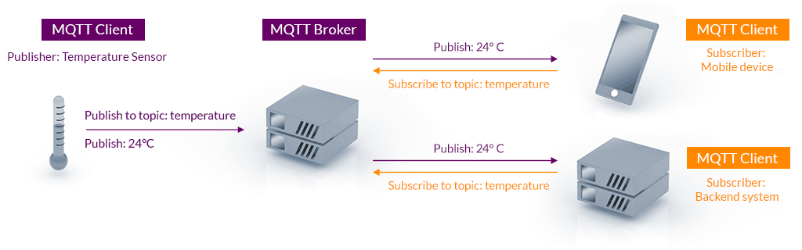
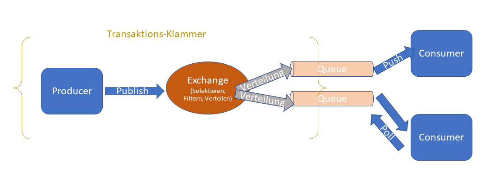

# Messaging

## Monolith vs. Verteilte Anwendungen

### Vorteile verteilter Anwendungen

- Flexiblere Skalierbarkeit
- Entwicklung, Wartbarkeit, Fehlersuche einfacher, da Anwendungen aufgeteilt (isoliert)
- Austauschbarkeit einzelner Module ist einfacher
- bei Ausfall eines Moduls fällt nicht alles aus
- pro Anwendung kleinere Teams -> Abstimmungsaufwände team-intern geringer
- Implementierung in unterschiedlichen Programmiersprachen möglich

### Herausforderungen verteilter Anwendung

- Netzwerk von Anwendungen
  - Integrationstest  
  - Fehlersuche komplexer, wenn zwischen den Anwendungen
  - Staging
- Höhere Aufwände für Datenbanken (Migration), Bauen, Testen, Deployment, Projektmanagement
  - Automatisierung!
- Resilience Patterns
- evtl. mehr Personal
- mehr Abstimmung zwischen den Teams
- sauber definierte Aufrufschnittstellen (REST vs. SOAP)
- Netzwerklatenzen (langsamer)
- Datenhoheit
- CAP-Theorem

### CAP-Theorem 

- 3 Kriterien
  - _Consistency_: Daten sind konsistent über das Gesamtsystem (an Anwendungen)
  - _Availability_: Anfragen an das Gesamtsystem werden performant beantwortet
  - _Partition Tolerance_: bei Ausfall eines Knotens funktioniert noch der Rest
- bei verteilten Anwendungen können nur 2 von 3 Anforderungen erfüllt werden
  - _CA_: relationale Datenbanksysteme (DBMS)
  - _AP_: DNS (mehrere Server, aber Synchronisation dauert mitunter mehrere Tage)
  - _CP_: Finanzen / Banking (Überweisungen)

## Synchrone vs. asynchrone Kommunikation

### Beispiele für synchrone Kommunikation aus dem Alltag
- Frage im Kurs
- Telefonat / Videokonferenz

### Beispiele für asynchrone Kommunikation aus dem Alltag
- Emails
- Chat
- Auftrag an Kollegen (Delegation von Aufgaben)

## Direkte vs. Indirekte Kommunikation

- Direkter Austausch
  - einfach
- Messaging: indirekter Austausch über eine dritte Instanz
  - Beispiel: Email/Chat/Briefe
  - Empfänger muss nicht direkt greifbar sein
  - lose Kopplung
  - Spezialisierung auf diese Aufgabe

## Grundbegriffe

- Message, Producer, Broker, Consumer
- Backpressure: wenn Producer schneller ist als Consumer
- Push-based vs Pull-based
  
- Full Load vs. Delta Load (Was schicke ich an Daten?)
  - _Delta_: Versand von Datenänderungen (performanter bei großen Datensätzen)
  - _Full_: Versand des gesamten Datenbestands (robuster bei Verlust einzelner Nachrichten)
- Übermittlungsgarantien
  - Persistenz von Nachrichten (Lebensdauer / Expiration Time)
  - Reihenfolge
  - Only-Once-Delivery (Acknowledgments)

## Szenarien

### Topic / Subscribe (PubSub)

- Vergleich: Newsletter
- mehrere Empfänger (Subscriptions)
  - durable (wenn Consumer kurzzeitig nicht verfügbar ist, wird Nachricht gespeichert)
  - non-durable
- Push-based
- Topic (Destination am Broker): semantische Ziel am Broker
- 👍 Skalierbarkeit
- 👍 lose Kopplung (kein Wissen, woher die Nachricht kommt)
- 👎 kein Wissen, ob die Nachricht überhaupt verarbeitet wird

### P2P-Messaging (Queue)

- eine Message wird exakt von einem Consumer verarbeitet
- Pull+Push based
- Queue (Destination am Broker)
- Sortierung der Messages: Reihenfolge, Ausnahme: Priorisierung
- Anwendungsfälle:
  - einmalige Verarbeitung einer Message
  - Kommunikation mit externen System (Puffern) -> analog Poststelle
  - (synchrone) Kommunikation (2 Queues: Hin+Rück) -> lose Kopplung

[Quellenempfehlung](https://www.oreilly.com/library/view/java-message-service/9780596802264/ch04.html)

## APIs & Protokolle

### Java Message Service (JMS)

- Java-native API (standardisierte Schnittstelle) - kein Protokoll
- PubSub + P2P
- Begriffe
  - JMS Provider = Messaging System
  - "Treiber" = Resource Adapter (Java EE) = Implementierung der Zugriffe für den jeweiligen Hersteller
  - JMS Client = Java-Anwendung, die Messages senden/empfangen kann (Producer / Consumer)
- Aufbau der Messages
  - Header = standardisierte Metainformationen, z.B. Priorisierung, Timestamp, Expiration Date
    (https://www.ibm.com/docs/en/sdi/7.2.0.3?topic=connector-jms-headers-properties)
  - Properties = nicht-standardisierte Metainformationen
  - Body = Inhalt zum Versenden (Daten, Events = Payload)
  - Nachrichtenarten
    - Text
    - Map (Key-Value-Paare, JSON)
    - Java-Objekte (Java-native Serialisierung: RMI)
    - Stream (Strom von einfachen Datentypen, z.B. `15abc3.5`)
    - Byte-Array

### Message Queuing Telemetry Transport (MQTT)
- Entstehung bei der IBM durch besondere Anforderungen des IoT
  - begrenzte Leistung (Ressourcen)
  - geringe Bandbreite
  - unterschiedliche Programmiersprachen
  - schnelles Finden der Gegenstelle
- einfach: 5 API-Methoden
- Protokoll ist binär, auf möglichst geringen Overhead ausgelegt
- Aggregation von Daten über Hubs
- kein P2P
- Es gibt Quality-Of-Service Definitionen:
  - at most once
  - at least once
  - exactly once
- aber: Persistence ist nicht teil der Spezifikation
- mit aktuellen Versionen auch Security-Mechanismen und TLS sehr gut unterstützt
- Topics sind Pfade für Publish und Subscribe
  - Publish
    `/devices/heizung/thermostat/t1/temp/ist`
    `/devices/heizung/thermostat/t1/temp/soll`
  - Subscribe
    `/devices/heizung/thermostat/#`
    `/devices/heizung/thermostat/+/temp/ist`

### Advanced Message Queuing Protocol (AMQP)
- Motivation: Herstellerunabhängigkeit
  - z.B. kein Resource Adapter wie bei JMS
  - flexiblere Wahl der Client-Plattformen
- Definiert Transaktions-Verhalten
  - Acknowledgement
  - Commit-Rollback Verhalten
- Berücksichtigt Security-Anforderungen (TLS, Authentifizierung)
- OSI Anwendungsschicht (Layer 7)
- Es gibt Quality-Of-Service Definitionen:
  - at most once
  - at least once
  - exactly once

### Simple Text Orientated Messaging Protocol (STOMP)
- text-basiert
  - Nachrichtenversand mit einfachen Clients: telnet client
  - Rabbit MQ WebStomp: Browser-Client
- [Stomp JS](https://stomp-js.github.io/stomp-websocket/codo/extra/docs-src/Usage.md.html)
- [Spezifikation](https://stomp.github.io/stomp-specification-1.2.html)

### Vergleich: MQTT, AMQP & STOMP

|                           | MQTT                                                               | AMQP                                                                                                                                                                            | STOMP                                                                                                                            |
|---------------------------|--------------------------------------------------------------------|---------------------------------------------------------------------------------------------------------------------------------------------------------------------------------|----------------------------------------------------------------------------------------------------------------------------------|
| Besonderheit / Motivation | Anforderungen des IoT                                              | Herstellerunabhängigkeit                                                                                                                                                        | Fokus auf Einfachheit, Leichtgewichtigkeit, Interoperabilität                                                                    |
| Syntax                    | binär, komprimierte Header, keine Properties                       | binär (Header+Body)                                                                                                                                                             | text-basiert (analog)                                                                                                            |
| Szenarien                 | kein P2P, nur PubSub (non-durable)                                 | P2P + PubSub                                                                                                                                                                    | Abstraktionsschicht: Befehle `SEND`oder `SUBSCRIBE`, Broker übersetzt das in Queue/Topics                                        |
| Standardisierung          | OASIS (ISO/IEC 20922)                                              | OASIS (ISO 19464)                                                                                                                                                               | -                                                                                                                                |
| Broker                    | Mosquitto, HiveMQ, ActiveMQ, IBMMQ, Cloud-Services bei AWS & Azure | ActiveMQ, RabbitMQ, IBMMQ                                                                                                                                                       | Active MQ                                                                                                                        |
| Java-API (unvollständig)  | [Eclipse Paho](https://www.baeldung.com/java-mqtt-client)          | [Spring](https://spring.io/projects/spring-amqp), [Apache Qpid](https://qpid.apache.org/), [JMS Resource Adapter for AMQP](https://github.com/amqphub/amqp-10-resource-adapter) | [Spring](https://docs.spring.io/spring-integration/reference/html/stomp.html), [Vert.X](https://vertx.io/docs/vertx-stomp/java/) |

## Kafka

- Motivation: Anforderungen aus Cloud-Systemen
  - viele kleine Anwendungen (Microservices)
  - viele direkte Verknüpfungen
  - hohe Dynamik (automatische Skalierung durch Cloud, häufigere Anwendungsstarts)
- kein P2P, nur PubSub
- Nachrichtenformat nicht standardisiert, sondern Verantwortung des Producers
- kein Transaktionskonzept
- keine Java-EE-Standards: kein JMS, AMQP, MQTT...
  - [Kafka Client](https://mvnrepository.com/artifact/org.apache.kafka/kafka-clients/3.1.0)
  - [Spring for Kafka](https://spring.io/projects/spring-kafka)
  - [Java EE: CDI Extension](https://github.com/aerogear/kafka-cdi)
- hohe Skalierbarkeit: _Topic_ besteht aus _Partitions_ (>=1)
  - Partitions sind verteilbar auf mehrere Knoten
  - Reihenfolge nur pro Partition verbindlich
- hoher Durchsatz
  - Fire & Forget (mehr flüchtige Nachrichten, keine Acknowledgements)
    - Vorsicht bei Delta Load (_Event Sourcing_)!
  - Messages persistent, pro Consumer gibt es einen Offset (klassische MQ: Verarbeitung des Zustands pro Nachricht)
- Einsatzszenarien
  - _Distributed Streaming Platform_: dauerhafter Versand des aktuellen Zustands (fachlich, Logs, Performance, ...)
  - auch als trad. MQ möglich (aber nicht umgekehrt)
